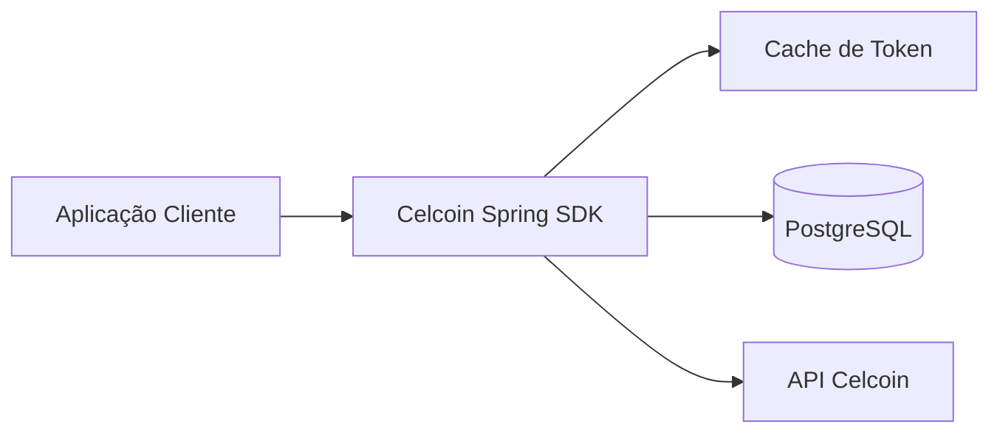

# Celcoin Spring SDK

SDK Spring Boot para encapsular integrações com APIs da Celcoin em aplicações Java 21. O projeto funciona como biblioteca/starter e também como aplicação de demonstração.

## Visão Geral



O SDK implementa autenticação, operações BaaS/Core, Pix, onboarding, boletos,
cartões, crédito, Open Finance, webhooks e os demais módulos descritos no
checklist. Produtos dependentes de contrato continuam sinalizados
explicitamente no checklist, sem endpoints inventados.

Para o aplicativo mobile, consulte [docs/react-native.md](docs/react-native.md)
e a seção **Frontend React Native** do
[checklist](docs/celcoin-implementation-checklist.md). O app deve consumir uma
API BFF; segredos Celcoin, mTLS, SFTP e webhooks permanecem no backend.

## Requisitos

- Java 21
- Docker e Docker Compose
- Maven Wrapper incluído em `./mvnw`

## Configuração

Copie `.env.example` para `.env` e ajuste as variáveis:

```bash
cp .env.example .env
```

Configuração Spring:

```yaml
celcoin:
  enabled: true
  environment: sandbox
  base-url: ${CELCOIN_BASE_URL}
  client-id: ${CELCOIN_CLIENT_ID}
  client-secret: ${CELCOIN_CLIENT_SECRET}
  token-path: /v5/token
  connect-timeout: 5s
  read-timeout: 20s
  token-refresh-margin: 60s
  demo-enabled: false
  webhook:
    secret: ${CELCOIN_WEBHOOK_SECRET:}
```

Credenciais reais não devem ser versionadas.

## Execução Local

```bash
docker compose up -d
./mvnw spring-boot:run -Dspring-boot.run.profiles=local
```

Health check:

```bash
curl http://localhost:8080/actuator/health
```

## Uso Como SDK

```xml
<dependency>
  <groupId>com.brunopedraca</groupId>
  <artifactId>celcoin-spring-sdk</artifactId>
  <version>0.1.0-SNAPSHOT</version>
</dependency>
```

Exemplo:

```java
CelcoinTokenResponse token = celcoinClient.authentication().getToken();
CelcoinBalanceResponse balance = celcoinClient.accounts().getBalance(accountId);
CelcoinPixPaymentResponse payment = celcoinClient.pix().cashOut(request);
CelcoinBoletoResponse boleto = celcoinClient.boletos().issue(request);
```

## Autenticação

O SDK envia `client_id`, `client_secret` e `grant_type=client_credentials` para `POST /v5/token`. O token é mantido em cache Caffeine, renovado antes do vencimento e protegido por trava para evitar múltiplas renovações simultâneas.

```bash
curl -X POST http://localhost:8080/demo/auth/token
```

Esse endpoint demo só deve ser habilitado localmente.

## Pix

Interfaces disponíveis:

- `createQrCode`
- `getQrCodeStatus`
- `listReceipts`
- `refund`
- `lookupKey`
- `decodeEmv`
- `cashOut`
- `participants`
- chaves Pix
- agendamento
- split Pix

Pix Automático (recorrência) em `pixAuto()`:

- consentimento e autorização (pagador e recebedor)
- agendamento e consultas
- liquidação e retentativas
- cancelamento de consentimento, agendamento e recorrência

Exemplo demo:

```bash
curl -X POST http://localhost:8080/demo/pix/cash-out \
  -H 'Content-Type: application/json' \
  -H 'Idempotency-Key: demo-123' \
  -d '{"accountId":"acc","pixKey":"chave","amount":10.50,"description":"teste"}'
```

Até que os contratos oficiais de Pix sejam adicionados, esses métodos retornam erro controlado informando que o endpoint não está configurado.

## Boletos

Interfaces disponíveis:

- `issue`
- `get`
- `list`
- `cancel`
- `downloadPdf`

Exemplo demo:

```bash
curl -X POST http://localhost:8080/demo/boletos \
  -H 'Content-Type: application/json' \
  -H 'Idempotency-Key: boleto-123' \
  -d '{"accountId":"acc","amount":99.90,"dueDate":"2026-08-10","payer":{}}'
```

## Webhooks

Endpoint público:

```bash
curl -X POST http://localhost:8080/webhooks/celcoin \
  -H 'Content-Type: application/json' \
  -d '{"id":"evt-1","type":"pix.cashin"}'
```

Admin:

```bash
curl http://localhost:8080/admin/webhooks
curl -X POST http://localhost:8080/admin/webhooks/{id}/retry
```

Quando `celcoin.webhook.secret` está configurado, o SDK espera:

- `X-Celcoin-Timestamp`
- `X-Celcoin-Signature`

A assinatura é validada com HMAC-SHA256 sobre `timestamp.payload`.

## Testes

```bash
./mvnw clean verify
```

Cobertura atual:

- cache e renovação de token
- WireMock para `POST /v5/token` (sucesso, erro de status e resposta sem token)
- idempotência: registro por operação, replay de resposta, conflito por chave reutilizada e rate limit
- mTLS: construção do `SslContext` e aplicação no `WebClient`
- ausência de Bearer Token no endpoint de token
- mascaramento de CPF, CNPJ e segredos
- deduplicação de webhook
- migrations Flyway com PostgreSQL Testcontainer
- teste pendente documentado para contratos Pix oficiais

## Docker

```bash
docker compose up -d
docker compose ps
docker compose down
```

Redis existe no Compose como perfil opcional:

```bash
docker compose --profile redis up -d
```

## Segurança

- Tokens e segredos não são registrados em logs.
- CPF/CNPJ e campos sensíveis são mascarados.
- Webhook possui limite de tamanho de payload.
- Webhook possui deduplicação por ID externo.
- Requisições financeiras não devem ser retentadas sem idempotency key.
- Idempotência persistente por operação: `CelcoinIdempotencyService` registra cada `Idempotency-Key`, rejeita reuso com request diferente e reproduz respostas concluídas.
- Rate limit: respostas `429` são convertidas em `CelcoinRateLimitException` com `Retry-After` e headers `X-RateLimit-*`.
- mTLS habilitado via `celcoin.ssl.enabled=true` e `CelcoinSslContextProvider`.

## CI

O pipeline em `.github/workflows/ci.yml` executa `spotless:check`, `verify`
(incluindo a régua JaCoCo) e publica o artefato `SNAPSHOT` no GitHub Packages.

## Roadmap

1. Confirmar URLs e payloads oficiais de contas, Pix e boletos.
2. Implementar auditoria sanitizada no `CelcoinHttpClient`.
3. Adicionar Redis como implementação alternativa para cache de token.
4. Adicionar módulos Open Finance, ITP, crédito, escrow, NFS-e e antifraude.
